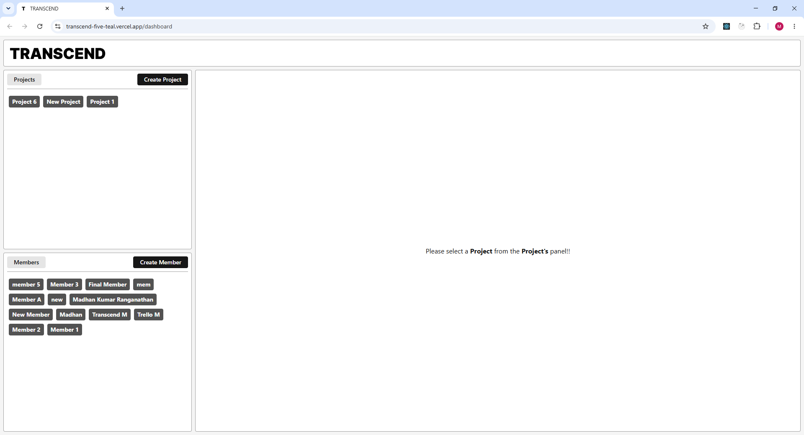
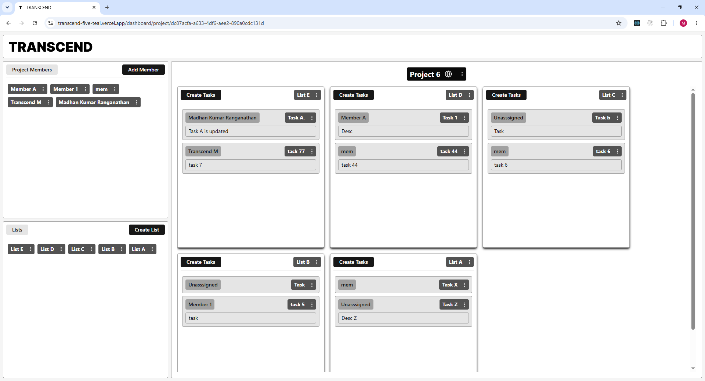

# TRANSCEND | Project Management App

A project management dashboard to create, manage, and track tasks.

**Live Demo:** [https://transcend-five-teal.vercel.app/]

https://github.com/user-attachments/assets/041dc1f2-216e-4c9f-9359-211ffef8f125

## Tech Stack

- **Front-end:** React, TypeScript, Tailwind CSS, TanStack Query
- **Backend-as-a-Service:** Supabase (Sample Schema added in the repo)

## Features

- **Project:** Create | Update attributes | Delete | Change Privacy.
- **Member:** Create | Add to Project | Update attributes | Assigned/Unasssigned to tasks
- **Lists:** Create | Add Tasks to List | Update attributes | Delete
- **Tasks:** Create | Add to Lists | Update attributes | Assigned/UnAssigned to Members | Can Change Lists

## Authors

- LinkedIn: [@madhankumarr150896](https://www.linkedin.com/in/madhankumarr150896/)
- Mail: madhankumar150896@outlook.com

## Screenshots

### Frontend

### Backend

